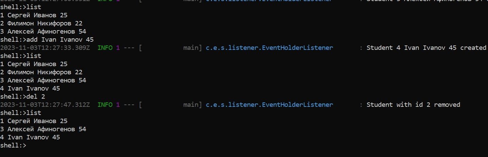

# StudentsAccounting_App

---
SpringBootShell приложение для учета студентов, позволяет добавлять, удалять студентов, а также выводить список всех студентов.
Взаимодействие с приложением происходит через shell-терминал.

---
Приложение можно запустить как в среде разработки, так и в контейнере Docker.

---
## Запуск приложения в среде разработки

Перед запуском необходимо зайти в файл настроек **application.properties** и выбрать один из двух режимов:
- app.creation.enabled=${APP_CREATION_ENABLED:false} - отключает загрузку студентов при старте приложения (установлено по умолчанию);
- app.creation.enabled=${APP_CREATION_ENABLED:true} - включает загрузку студентов из файла при старте приложения.
Файл со студентами находится в папке **resources**, информация о каждом студенте представляет собой строку с именем, фамилией и возрастом, разделенных между собой пробелом, например: "Иванов Сергей 25".
Путь к файлу настраивается с помощью свойства **app.path** в **application.properties**

---
## Запуск приложения в контейнере Docker

В корневой папке проекта находится Dockerfile для запуска приложения в docker-контейнере. Здесь также есть возможность установить один из вышеописанных режимов работы с помощью переменной APP_CREATION_ENABLED.
После этого необходимо собрать образ приложения. Для этого в командной строке нужно перейти в папку с проектом и выполнить команду:
```
docker build -t students-accounting .
```
Вместо students-accounting можно задать любое другое имя для контейнера.
Далее в командной строке необходимо запустить контейнер командой:

```
docker run -it students-accounting
```
---
## Список команд
В случае успешного запуска приложения можно работать с программой из shell-терминала посредством следующих команд:
- list - выводит все имеющиеся контакты;
- add firstName lastName age - добавление одного контакта, команда должна состоять из слова add, имени, фамилии и возраста, разделенные пробелами (пример пользовательского ввода: "add Ivan Ivanov 45");
- del id - удаление контакта по id, команда должна состоять из слова del и идентификационного номера студента, разделенные пробелом (пример пользовательского ввода: "del 1");
- all - удаление всех студентов из списка;
- exit - выход из программы.

