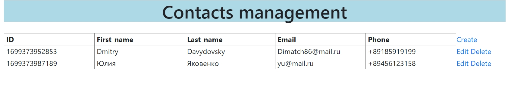

# ContactsList_App

---
SpringBoot приложение с базой данных для создания и хранения контактов.
Взаимодействие с приложением происходит через UI-интерфейс по url http://localhost:8081.



---
Приложение можно запустить как в среде разработки, так и в контейнере Docker. В качестве СУБД используется PostgreSQL, в качестве API - JDBC.

---
## Запуск приложения в среде разработки

В папке docker находится файл docker-compose.yml c контейнерами базы данных и приложения. 
Первый шаг - запуск контейнера базы данных 'contacts_database'. Открываем файл docker-compose в среде разработки и нажимаем на значок запуска напротив имени контейнера (зеленый треугольник), 
либо в командной строке переходим в папку docker и запускаем командой:
```
docker-compose run --service-ports contacts_database
```
После этого запускаем приложение из класса ContactsListApplication.

---
## Запуск приложения в контейнере Docker

Для запуска приложения в контейнере необходимо открыть файл docker-compose.yml в среде разработки и нажать значок запуска
напротив строки 'services', либо в командной строке перейти в папку docker и запустить командой:
```
docker-compose up -d
```
После этого приложение будет запущено вместе с базой данных и будет доступно по url: http://localhost:8081

---
## Список команд
В случае успешного запуска приложения можно работать с программой из UI-интерфейса посредством следующих команд:
- create - вызов формы для создания нового контакта. Все поля формы обязательны для заполнения и валидируются для предотвращения некорректного ввода данных. 
- edit - вызов формы для редактирования контакта, рядом с которым нажата кнопка;
- delete - удаление контакта, рядом с которым нажата кнопка.

---
## Настриваемые параметры

- порт для подключения к базе данных: устанавливается в файле application.yml, по умолчанию установлен порт 5433, 
при изменении необходимо задать такой же внешний порт для контейнера 'contacts_database' в файле docker-compose.yml;
- порт сервера приложения, по умолчанию установлен порт 8081. В случае запуска из среды разработки можно изменить его в файле application.yml.
В случае запуска приложения из docker-compose , меняется внешний порт контейнера 'backend'.

